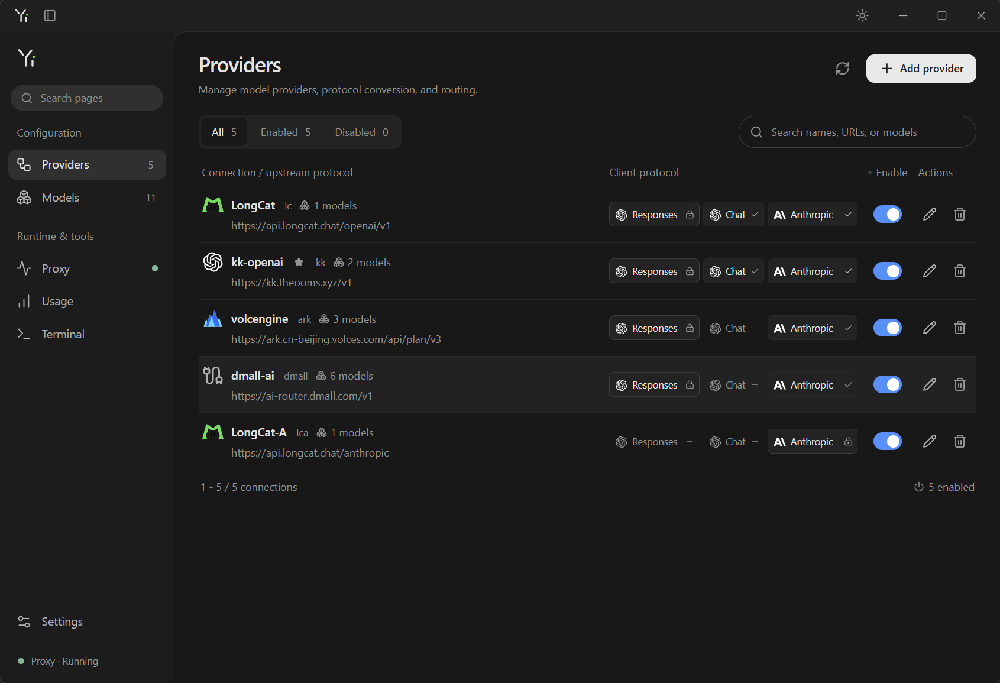
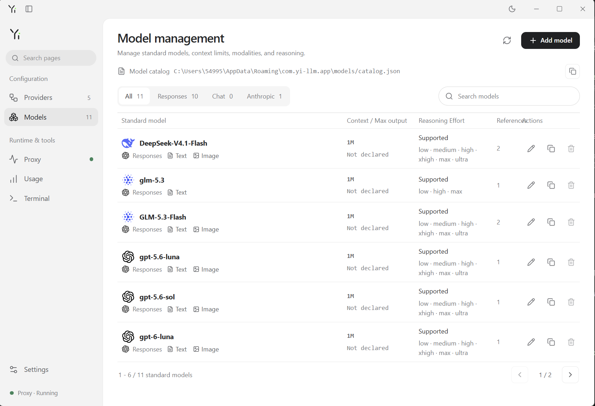
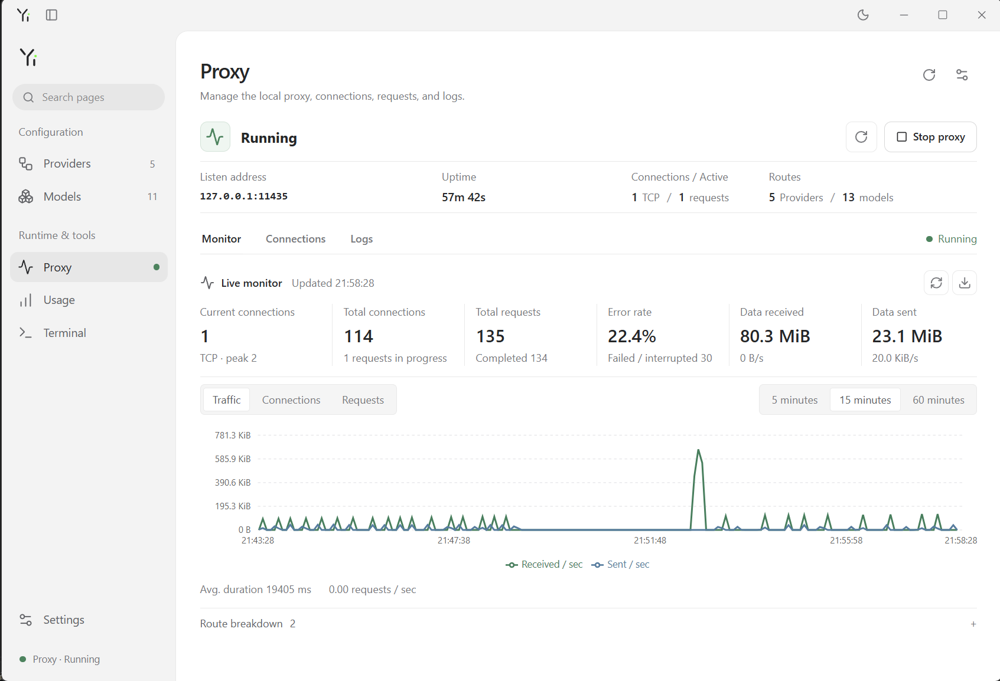
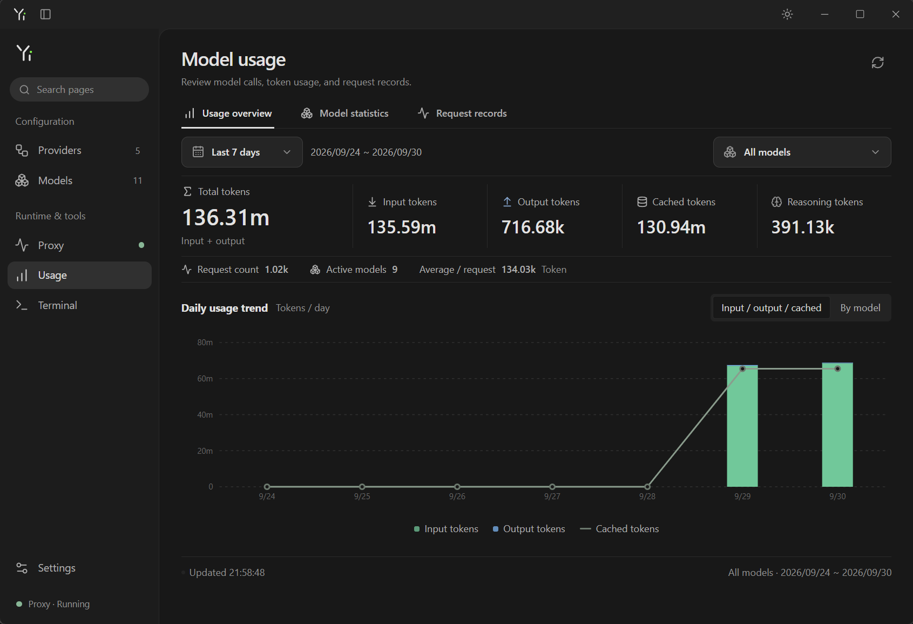
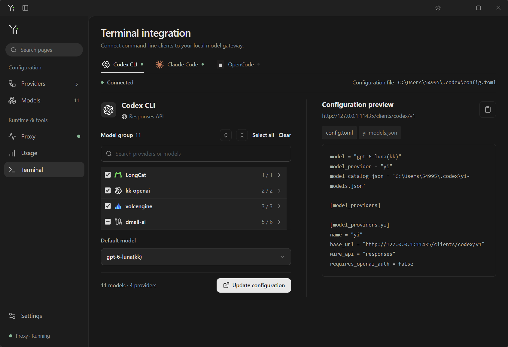

# yi-llm

<div align="center">
  
  <p><strong>本地多协议大模型网关与管理桌面应用</strong></p>
  <p>
    <a href="LICENSE"></a>
    
    
    
  </p>
  <p>中文 | <a href="README.en.md">English</a></p>
</div>

---

## 简介

**yi-llm** 是一款基于 Tauri 的桌面应用，在你的电脑上运行一个本地多协议模型代理：它同时接受 **OpenAI Responses**、**OpenAI Chat Completions** 与 **Anthropic Messages** 三种协议的请求，并按你配置的路由规则转发到 Anthropic Messages、OpenAI Chat Completions 或 Responses API 上游 Provider。Provider 默认使用其原生协议直通；在设置中开启其它客户端协议后，代理会自动完成请求与响应的双向转换。

Provider 配置、模型映射与 token 用量保存在本地 SQLite 中；标准模型定义存放在可纳入 Git 版本管理的 JSON 目录（`models/catalog.json`）中，便于共享与评审。应用还提供实时代理监控、用量统计，以及面向 Codex CLI / Claude Code / OpenCode 等终端客户端的一键配置能力。界面支持简体中文 / 英文与浅色 / 深色主题。

## 界面预览

### Provider 管理

管理 Provider、上游协议、客户端协议开关与路由。



### 模型管理

标准模型拥有协议、厂牌图标、模态、上下文与推理努力策略；Provider 仅绑定真实上游模型名。



### 代理监控

启停控制、运行时长、TCP 连接、请求数、错误率与实时流量图表。



### 用量统计

按日 / 按模型 / 按协议汇总 token 用量（输入、输出、缓存、推理），支持请求明细与 CSV 导出。



### 终端接入

为 Codex CLI、Claude Code、OpenCode 生成并应用托管配置，含模型分组、默认模型与配置预览。



## 核心特性

- 🌐 **多协议本地代理**：默认监听 `127.0.0.1:11435`，同时提供 Responses、Chat Completions、Messages 三类客户端端点，以及 `GET /v1/models` 与 `GET /health`。
- 🔀 **跨协议双向转换**：文本对话、图片输入、function tools 与结果、Responses 命名空间工具、自定义文本工具、推理内容、token 上限与 JSON Schema 结构化输出均可跨协议翻译。
- 🧩 **标准模型目录**：模型定义与 Provider 解耦，多个 Provider 可引用同一标准模型；目录为可版本化、可共享的 JSON 文件，带编辑器 schema 与原子写入。
- 📈 **实时监控与用量统计**：连接数、请求数、错误率、收发流量图表与运行日志；token 用量按日 / 模型 / 协议汇总，含调用明细与 CSV 导出。
- 🖥️ **终端一键接入**：为 Codex CLI、Claude Code、OpenCode 生成托管配置，合并写入、自动备份、失败回滚，并支持原生模型选择器。
- 🌗 **双语界面与主题**：简体中文 / 英文界面，浅色 / 深色主题，统一的设计令牌与字体栈。
- 🔒 **纯本地运行**：配置与用量仅存于本地 SQLite；本地代理无需鉴权，SDK key 可使用占位符 `yi`。

## 工作原理

客户端以任意受支持协议请求本地代理，代理按「标准模型 → Provider 绑定」解析路由：原生协议直通转发，跨协议请求则完成请求 / 响应转换。

| 客户端协议              | 端点                          | 可路由上游                                        |
| ----------------------- | ----------------------------- | ------------------------------------------------- |
| OpenAI Responses        | `POST /v1/responses`        | Responses / Chat Completions / Anthropic Messages |
| OpenAI Chat Completions | `POST /v1/chat/completions` | Responses / Chat Completions / Anthropic Messages |
| Anthropic Messages      | `POST /v1/messages`         | Responses / Chat Completions / Anthropic Messages |

Provider 与模型映射的变更按请求生效，无需重启代理；仅监听地址（host / port）变更会重启监听器。

## 快速开始

环境要求：Node.js、npm、Rust stable，以及所在平台的 Tauri 原生构建依赖。

```powershell
npm install
npm run tauri dev                                  # 开发运行
cargo test --manifest-path src-tauri/Cargo.toml    # 后端测试
npm run tauri build                                # 打包
```

上手三步：

1. 在「模型管理」中创建标准模型（协议、模态、上下文、推理努力等）。
2. 在「Providers」中添加 Provider，填写真实上游模型名并引用匹配其原生协议的标准模型；如需跨协议客户端，在设置中开启对应协议转换。
3. 在「Proxy」页启动监听器，将客户端指向本地地址即可。

UI 测试使用 `npm run test:ui`（Playwright）；先执行 `npx playwright install chromium`，或设置 `PLAYWRIGHT_CHANNEL=msedge` 使用系统 Edge。

## 使用代理

| 用途                           | 地址                                                |
| ------------------------------ | --------------------------------------------------- |
| OpenAI SDK（Responses / Chat） | `http://127.0.0.1:11435/v1`                       |
| Anthropic SDK（Messages）      | `http://127.0.0.1:11435`（无协议路径）            |
| 直连 HTTP                      | 完整端点，如`http://127.0.0.1:11435/v1/responses` |
| Codex CLI                      | `http://127.0.0.1:11435/clients/codex/v1`         |
| Claude Code                    | `http://127.0.0.1:11435/clients/claude-code`      |
| OpenCode                       | `http://127.0.0.1:11435/clients/opencode/v1`      |

「Proxy → 协议地址」页展示各协议 Base URL 与完整请求 URL，可一键复制并显示兼容 Provider 数量。本地代理不校验鉴权，SDK key 填占位符 `yi` 即可。

终端专用端点仅暴露所选模型集合：未知模型、未启用协议、被禁用 Provider 或已迁移模型都会被拒绝，且不回退到全局默认 Provider。修改监听地址或模型集合后需重新应用终端配置。

## 模型管理

标准模型拥有协议、厂牌图标、输入 / 输出模态、上下文长度、最大输出 token 与推理努力策略；Provider 绑定只保存真实上游模型名与标准模型引用，其名称独立于标准模型显示名。修改标准模型会影响所有关联路由的下一次请求。

全部标准定义维护在 [models/catalog.json](models/catalog.json)：开发构建读写仓库内文件；打包构建使用 `<app-data>/models/catalog.json`；设置 `YI_LLM_MODEL_CATALOG` 为绝对路径可改用 Git 检出目录。「模型管理」页展示并复制当前生效路径。外部修改会在读取模型与发起请求前校验，非法版本报错并保留上一份有效缓存。详见 [目录指南](models/README.md)。

## 用量统计

「用量」页展示可读的 `Provider / 模型名` 标签与模型厂牌图标：总 token、输入 / 输出 / 缓存 / 推理 token、请求数、活跃模型数与单请求均值；按日趋势图区分输入 / 输出 / 缓存，并可按模型查看。请求记录保留协议、时长与 token 明细，支持 CSV 导出（含原始路由 ID）。

## 终端接入

在「终端」页选择客户端、勾选启用的 Provider 与模型集合、设定默认模型，即可生成托管配置并应用到本地配置文件。

| 客户端      | 协议                    | 原生模型选择 | 托管文件                                                       |
| ----------- | ----------------------- | ------------ | -------------------------------------------------------------- |
| Codex CLI   | OpenAI Responses        | `/model`   | `~/.codex/config.toml`, `yi-models.json`                   |
| Claude Code | Anthropic Messages      | `/model`   | `~/.claude/settings.json`                                    |
| OpenCode    | OpenAI Chat Completions | `/models`  | `~/.config/opencode/opencode.json` 或已有 `opencode.jsonc` |

上述路径尊重 `CODEX_HOME`、`CLAUDE_CONFIG_DIR`、`XDG_CONFIG_HOME` 与 `OPENCODE_CONFIG`。应用配置时与现有文件合并、为被覆盖文件创建备份并原子替换；写文件或保存集合失败时自动恢复原文件。预览仅展示托管设置，不包含无关凭据与 hooks。

Codex 使用原生 `model_catalog_json` 目录，`/model` 会列出所选模型及其能力；Claude Code 使用原生 `modelPicker.options`，要求 **2.1.242 及以上**；OpenCode 使用官方 OpenAI 兼容 provider 配置。原生模型选择已在 Codex **0.158.0**、Claude Code **2.1.283**、OpenCode **1.14.50** 上验证。应用配置后请重启终端会话；代理需在终端发送请求时保持运行。

## 协议能力与限制

- 跨协议转换覆盖：文本对话、图片输入（Anthropic 上游要求 base64 data URL）、function tools 与结果、Responses 命名空间工具（上游扁平化、输出还原）、自定义文本工具、推理文本、token 上限与 JSON Schema 结构化输出（`text.format` → Anthropic `output_config.format` / Chat `response_format`）。
- 推理 payloads 跨轮保留：Anthropic `signature_delta` / `redacted_thinking` 以 reasoning item 的 `encrypted_content` 呈现并在下一轮回传；Chat Completions 的 `reasoning_content` 在 assistant 消息上重放并映射为推理输出。
- 提示缓存用量通过 `input_tokens_details.cached_tokens` 上报。
- 有状态 Responses 请求（`store=true` 或 `previous_response_id`）与文件输入在跨协议转换时被拒绝。
- Responses 服务端工具（如 `web_search`）在上游无法执行时被省略；其它内置工具需要原生 Responses 上游。原生连接保留 Provider 专属请求字段。

## 开发

```powershell
npm run dev           # 仅前端 Vite 开发服务
npm run typecheck     # TypeScript 类型检查
npm run lint          # ESLint
npm run format        # Prettier 格式化
npm run test:ui       # Playwright UI 测试
npm run check:theme   # 主题令牌检查
```

后端为分层 Rust 代码（`commands → service → db / catalog / terminal / proxy → domain`），集成测试位于 `src-tauri/tests/`（wiremock 模拟上游）；前端按 feature-sliced 组织，共享 i18n、导航、通知、主题与通用 UI。代码布局、分层规则与迁移说明见 [docs/architecture.md](docs/architecture.md)。

## 项目结构

```
src/          React 前端（feature-sliced）
src-tauri/    Rust 后端：代理、协议转换、SQLite、终端配置
models/       标准模型目录 JSON + schema
docs/         架构文档与截图
tests/        Playwright UI 测试
scripts/      辅助脚本（主题令牌检查等）
```

## 许可证

本项目基于 [MIT 许可证](LICENSE) 发布。© 2026 peng.yi

`src/assets/providers/` 中的厂牌图标改编自 [cc-switch](https://github.com/farion1231/cc-switch)（MIT），该目录内附署名与许可证文本；协议标识使用各公司 logo（OpenAI 对应 Responses 与 Chat Completions，Anthropic 对应 Messages）。
